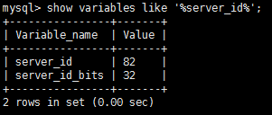

# MYSQL实现主从数据库 #

准备好主从服务器

主节点服务器 ：45.32.118.191
主节点服务器 ：139.180.192.82

配置主从服务器

主节点服务器配置
```
vi /etc/my.cnf
```
 在# Recommended in standard MySQL setup下添加
```
server_id=191
log-bin=mysql-bin
```
重启服务
```
service mysql restart
```
进入mysql，输入命令
```
show variables like '%server_id%';
```
查到刚刚的设置表示设置成功。


```
show master status;
```
找到日志文件名字mysql-bin.000001

从节点服务器配置
```
vi /etc/my.cnf
```
 在# Recommended in standard MySQL setup下添加
```
server_id=82
log-bin=mysql-bin
binlog_do_db=test   //需要同步的数据库
```
用相同的方法在从数据库中检查设置是否生效
```
show variables like '%server_id%';
```

主从同步命令
master_host 主服务器地址

master_user 主服务器用户名

master_password 主服务器密码

master_log_file 主服务器配置文件(刚刚查看的文件名）

master_log_pos 主服务器读取配置文件的开始位置，也就是从第多少行开始读取。
```
change master to master_host='45.32.118.191',master_user='root',master_password='root',master_log_file='mysql-bin.000001',master_log_pos=120;
```

```
start slave;
```
```
·
```
如果是克隆的服务器，会出现下面的情况
Slave_IO_Running  no
Slave_SQL_Running yes
```
Fatal error: The slave I/O thread stops because master and slave have equal MySQL server UUIDs; these UUIDs must be different for replication to work。
```
这是由于server-uuid一致导致的
需要将 `/var/lib/mysql`  文件下的生成uuid 的文件删除，然后再重新启动 mysql 服务
主服务的日志文件与从数据库的日志文件不一致时，也会出现Slave_IO_Running  no
的情况

如果同步出错，或者从数据库重启后会出现
Slave_SQL_Running no
的情况
这时需要：
```
STOP SLAVE;
SET GLOBAL sql_slave_skip_counter=1;
START SLAVE;
```
或者
```
SHOW SLAVE STATUS/G;
```
根据错误提示解决问题

这样简单的主从数据库就搭建完毕（数据库主从复制）